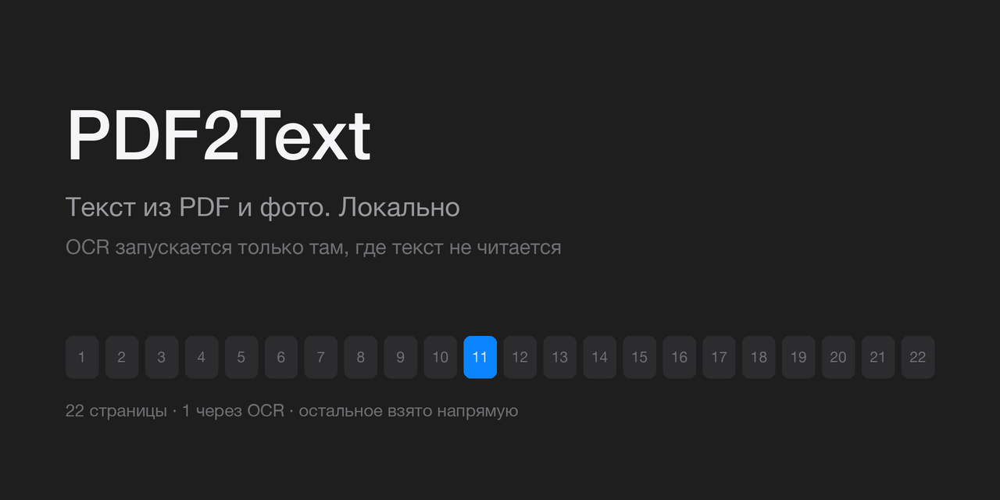
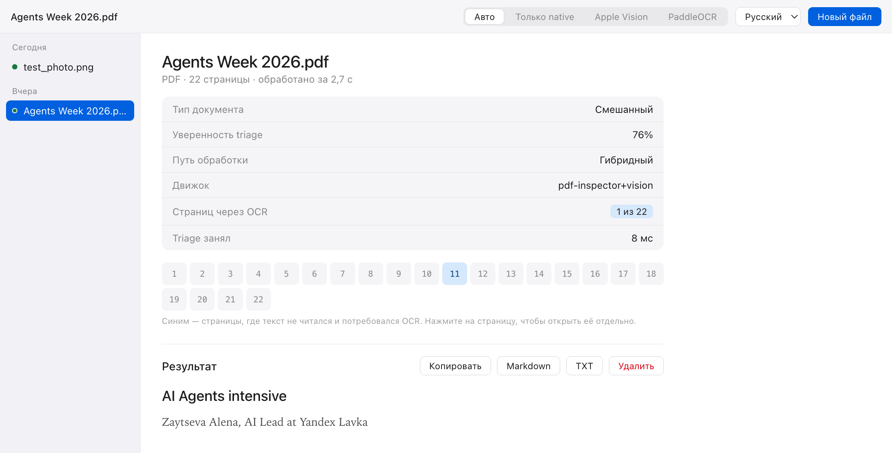

# PDF2Text

Текст из PDF и фотографий — на вашем компьютере. Ничего не уходит в облако.

Скачать готовую сборку для macOS — во вкладке
[Releases](https://github.com/Timur99/PDF2Text/releases).

## Главное отличие

**OCR — не первый шаг.** Большинство инструментов прогоняют весь PDF через
распознавание, даже если внутри уже лежит текстовый слой: это медленно, греет
процессор и портит то, что было идеальным.

PDF2Text сначала делает triage: локальная библиотека `pdf-inspector` за единицы
миллисекунд определяет тип документа и забирает текст напрямую со страниц, где
он читается. Распознавание запускается только на остатке.

<picture>
  <source media="(prefers-color-scheme: dark)" srcset="docs/images/app-dark.png">
  
</picture>

На этом документе из 22 страниц распознавание понадобилось для одной. Остальные
взяты напрямую, triage занял 8 мс. Синяя ячейка в карте страниц — та самая
страница; по ней можно кликнуть и посмотреть отдельно.

Интерфейс всегда показывает, каким путём получен результат — `native`, `ocr`
или `hybrid` — и сколько страниц ушло в распознавание. Если система что-то
упростила или урезала, об этом написано на экране, а не только в логах.

## Установка

Нужен Python 3.11+ и macOS.

```bash
python3 -m venv .venv
source .venv/bin/activate
pip install -e ".[dev,vision]"
```

PaddleOCR — запасной движок, весит сотни мегабайт и нужен не всем:

```bash
pip install -e ".[ocr]"
```

## Приложение

```bash
local-ocr
# http://127.0.0.1:8765
```

Перетащите PDF или фотографию в окно. Слева — история задач, справа — результат
с картой страниц, фактами triage и текстом. Экспорт в Markdown и TXT, удаление
задачи вместе с исходником.

## Командная строка

```bash
pdf2text scan.pdf > out.md
```

Прогресс идёт в stderr, результат — в stdout, поэтому вывод можно перенаправлять
и передавать по пайпу. Документ обрабатывается во временном каталоге, который
удаляется на выходе.

| Флаг | Что делает |
|---|---|
| `-o, --output FILE` | записать в файл вместо stdout |
| `-e, --engine auto\|native\|vision\|paddleocr` | режим обработки (по умолчанию `auto`) |
| `-l, --lang ru` | язык распознавания |
| `-f, --format md\|txt\|json` | формат вывода (по умолчанию `md`) |
| `-q, --quiet` | не печатать прогресс |

Коды возврата: `0` — успех, `1` — ошибка обработки, `2` — файл не найден.

## Режимы

| Режим | Когда нужен |
|---|---|
| **Авто** | Для всего подряд. Текст берётся напрямую, распознавание — только там, где его нет |
| **Только native** | Для PDF с готовым текстовым слоем: мгновенно и точно. На сканах откажется работать |
| **Apple Vision** | Для сканов, фото и многоколоночных страниц. Принудительно для всех страниц |
| **PaddleOCR** | Запасной. Если Vision промахнулся на конкретном файле, или система не macOS |

Дефолтный движок распознавания — **Apple Vision**. Он встроен в macOS, не
занимает места в сборке и на замере из восьми страниц оказался в 16 раз быстрее
PaddleOCR при лучшем порядке чтения на многоколоночных страницах: 4,3 с против
68,4 с. Методика и полные цифры — в [DECISIONS.md](docs/DECISIONS.md).

## Как устроен путь документа

```text
файл → проверка → triage (pdf-inspector)
                    ├── страницы с текстом  → берём напрямую
                    └── остальные страницы  → OCR (Vision или PaddleOCR)
                                              ↓
                              сборка → Markdown / TXT / JSON
```

Домен не знает про SDK движков: маршрутизация — чистые функции в
`backend/domain/routing.py`, движки живут за общим протоколом в
`backend/engines/`. Новый движок добавляется адаптером, без правок API и UI.

## Приватность

- Сервер слушает только `127.0.0.1`.
- Документы никуда не отправляются: и triage, и оба движка работают локально.
- Содержимое документов не пишется в логи.
- Телеметрии нет.

## Сборка приложения для macOS

```bash
.venv/bin/pyinstaller desktop/pdf2text.spec --noconfirm \
    --distpath desktop/dist --workpath desktop/build
./desktop/build_app.sh
```

Получается `desktop/dist/PDF2Text.app` и `PDF2Text-<версия>.dmg`. Подробности и
идентификаторы сборки — в [desktop/README.md](desktop/README.md).

## Документация

| Документ | О чём |
|---|---|
| [ARCHITECTURE.md](docs/ARCHITECTURE.md) | Компоненты, слои, контракты движков |
| [DESIGN.md](docs/DESIGN.md) | Интерфейс: токены, компоненты, состояния |
| [DECISIONS.md](docs/DECISIONS.md) | Журнал решений с обоснованиями и замерами |
| [PROJECT_PLAN.md](docs/PROJECT_PLAN.md) | Этапы и критерии готовности |
| [SPEC-stage-1.5.md](docs/SPEC-stage-1.5.md) | Спецификация текущего этапа |

## Тесты

```bash
pytest
```

## Статус

Рабочий MVP: приложение, CLI и сборка DMG собираются и работают. Идёт этап
стабилизации — персистентность задач между перезапусками, retention, очередь с
отменой и проверка типа файла по содержимому. Что именно ещё не сделано,
перечислено в [SPEC-stage-1.5.md](docs/SPEC-stage-1.5.md).
