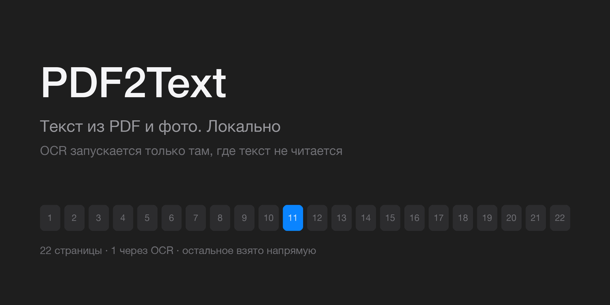
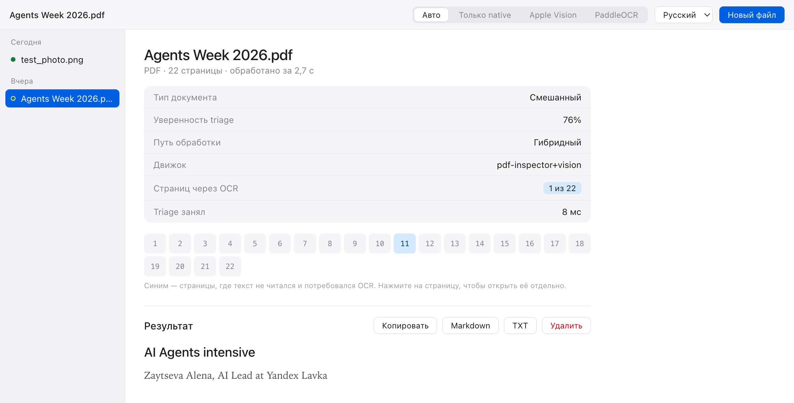

# PDF2Text — Local PDF & Image OCR MCP

**Локальный MCP-сервер для AI-агентов и приложение для macOS: текст из PDF, сканов и фотографий.**

Подключите PDF2Text к агенту с поддержкой локальных MCP-серверов: агент сможет
прочитать указанный документ и получить текст или Markdown для поиска, анализа
и работы с вашими материалами. Готовый текст из PDF извлекается напрямую,
OCR запускается только для страниц, которым он нужен. Если страницы пропущены,
агент получает явное предупреждение.

**[Установить через агента](#установка-через-агента) · [Настроить вручную](docs/MCP.md) · [Скачать приложение для macOS](https://github.com/Timur99/PDF2Text/releases)**

Распознавание выполняется на вашем компьютере. При работе через MCP извлечённый
текст передаётся клиенту; если клиент использует облачную модель, текст может
попасть к её провайдеру.

## Установка через агента

**Скопируйте этот промпт в своего AI-агента — команды за вас выполнит он:**

```text
Установи и подключи PDF2Text MCP из https://github.com/Timur99/PDF2Text
к моему MCP-клиенту. Выполни установку сам по инструкции:
https://github.com/Timur99/PDF2Text/blob/main/docs/INSTALL_MCP.md

Сам определи текущий клиент, ОС и подходящий способ установки. Настрой доступ
к рабочей папке по инструкции, сохрани существующие MCP-подключения.
Выполни установку и проверь инструменты extract_text и list_engines.
В конце сообщи результат, доступную папку и нужен ли перезапуск клиента.
```

Подойдёт агент с доступом к терминалу и настройкам вашего компьютера. В обычном
чате без таких возможностей автоматическая установка недоступна. Первый запуск
может занять несколько минут: агент скачает зависимости и настроит подключение.
Основной проверенный вариант — macOS с Apple Vision; API-ключ для OCR не нужен.

После подключения напишите: «Прочитай через PDF2Text файл report.pdf в разрешённой
папке и выдели основные выводы». Для точного выбора можно указать полный путь к файлу.

<details>
<summary>Ручная установка и конфигурация MCP</summary>

Первая версия MCP доступна из исходников. Нужны Git, Python 3.11+;
для встроенного Apple Vision — macOS 13+. Установка на Mac:

```bash
git clone https://github.com/Timur99/PDF2Text.git
cd PDF2Text
python3 -m venv .venv
.venv/bin/python -m pip install ".[mcp,vision]"
.venv/bin/pdf2text-mcp --help
```

В настройках MCP-клиента укажите команду и аргументы (замените абсолютные пути):

```json
{
  "mcpServers": {
    "pdf2text": {
      "command": "/absolute/path/to/PDF2Text/.venv/bin/pdf2text-mcp",
      "args": ["--allow-dir", "/absolute/path/to/documents"]
    }
  }
}
```

Это пример для клиентов с конфигурацией `mcpServers`. В клиентах с формой
подключения используйте те же command и args. Клиент сам запускает сервер;
приложение macOS для этого открывать не нужно.

Пример запроса агенту: «Используй PDF2Text, прочитай
`/absolute/path/to/documents/report.pdf` и выдели основные выводы».

</details>

## Возможности MCP

- `extract_text` возвращает текст, сведения о страницах и предупреждения.
- `list_engines` показывает доступные движки.
- Доступны только каталоги, указанные через `--allow-dir`.
- В режиме `auto` OCR ограничен 12 страницами. Для полного распознавания скана
  выберите `vision` или попросите об этом агента. Общие лимиты — 200 страниц PDF и 80 MB.

Другие ОС, параметры инструментов и подробности подключения — в [MCP.md](docs/MCP.md).



## Главное отличие

**OCR — не первый шаг.** Большинство инструментов прогоняют весь PDF через
распознавание, даже если внутри уже лежит текстовый слой: это медленно, греет
процессор и портит то, что было идеальным.

PDF2Text сначала делает triage: локальная библиотека `pdf-inspector` за единицы
миллисекунд определяет тип документа и забирает текст напрямую со страниц, где
он читается. Распознавание запускается только на остатке.

<picture>
  <source media="(prefers-color-scheme: dark)" srcset="docs/images/app-dark.png">
  
</picture>

На этом документе из 22 страниц распознавание понадобилось для одной. Остальные
взяты напрямую, triage занял 8 мс. Синяя ячейка в карте страниц — та самая
страница; по ней можно кликнуть и посмотреть отдельно.

Интерфейс всегда показывает, каким путём получен результат — `native`, `ocr`
или `hybrid` — и сколько страниц ушло в распознавание. Если система что-то
упростила или урезала, об этом написано на экране, а не только в логах.

## Установка приложения из исходников

Нужен Python 3.11+ и macOS.

```bash
python3 -m venv .venv
source .venv/bin/activate
pip install -e ".[vision]"
```

PaddleOCR — запасной движок, весит сотни мегабайт и нужен не всем:

```bash
pip install -e ".[ocr]"
```

## Приложение

```bash
local-ocr
# http://127.0.0.1:8765
```

Перетащите PDF или фотографию в окно. Слева — история задач, справа — результат
с картой страниц, фактами triage и текстом. Экспорт в Markdown и TXT, удаление
задачи вместе с исходником.

## Командная строка

```bash
pdf2text scan.pdf > out.md
```

Прогресс идёт в stderr, результат — в stdout, поэтому вывод можно перенаправлять
и передавать по пайпу. Документ обрабатывается во временном каталоге, который
удаляется на выходе.

| Флаг | Что делает |
|---|---|
| `-o, --output FILE` | записать в файл вместо stdout |
| `-e, --engine auto\|native\|vision\|paddleocr` | режим обработки (по умолчанию `auto`) |
| `-l, --lang ru` | язык распознавания |
| `-f, --format md\|txt\|json` | формат вывода (по умолчанию `md`) |
| `-q, --quiet` | не печатать прогресс |

Коды возврата: `0` — успех, `1` — ошибка обработки, `2` — файл не найден.

## Режимы

| Режим | Когда нужен |
|---|---|
| **Авто** | Для всего подряд. Текст берётся напрямую, распознавание — только там, где его нет |
| **Только native** | Для PDF с готовым текстовым слоем: мгновенно и точно. На сканах откажется работать |
| **Apple Vision** | Для сканов, фото и многоколоночных страниц. Принудительно для всех страниц |
| **PaddleOCR** | Запасной. Если Vision промахнулся на конкретном файле, или система не macOS |

Дефолтный движок распознавания — **Apple Vision**. Он встроен в macOS, не
занимает места в сборке и на замере из восьми страниц оказался в 16 раз быстрее
PaddleOCR при лучшем порядке чтения на многоколоночных страницах: 4,3 с против
68,4 с. Методика и полные цифры — в [DECISIONS.md](docs/DECISIONS.md).

## Как устроен путь документа

```text
файл → проверка → triage (pdf-inspector)
                    ├── страницы с текстом  → берём напрямую
                    └── остальные страницы  → OCR (Vision или PaddleOCR)
                                              ↓
                              сборка → Markdown / TXT / JSON
```

Домен не знает про SDK движков: маршрутизация — чистые функции в
`backend/domain/routing.py`, движки живут за общим протоколом в
`backend/engines/`. Новый движок добавляется адаптером, без правок API и UI.

## Приватность

- Веб-сервер слушает только `127.0.0.1`; MCP использует stdio и не открывает порт.
- Triage и OCR работают локально, исходный файл сервер никуда не загружает.
- MCP передаёт извлечённый текст клиенту. Дальнейшая отправка в облачную модель
  зависит от клиента и его настроек.
- Содержимое документов не пишется в логи.
- Телеметрии нет.

## Сборка приложения для macOS

```bash
.venv/bin/pyinstaller desktop/pdf2text.spec --noconfirm \
    --distpath desktop/dist --workpath desktop/build
./desktop/build_app.sh
```

Получается `desktop/dist/PDF2Text.app` и `PDF2Text-<версия>.dmg`. Подробности и
идентификаторы сборки — в [desktop/README.md](desktop/README.md).

## Документация

| Документ | О чём |
|---|---|
| [ARCHITECTURE.md](docs/ARCHITECTURE.md) | Компоненты, слои, контракты движков |
| [DESIGN.md](docs/DESIGN.md) | Интерфейс: токены, компоненты, состояния |
| [DECISIONS.md](docs/DECISIONS.md) | Журнал решений с обоснованиями и замерами |
| [PROJECT_PLAN.md](docs/PROJECT_PLAN.md) | Этапы и критерии готовности |
| [MCP.md](docs/MCP.md) | Установка MCP-сервера, подключение и контракт инструментов |
| [INSTALL_MCP.md](docs/INSTALL_MCP.md) | Пошаговая установка и проверка подключения силами агента |
| [MCP_PUBLISHING.md](docs/MCP_PUBLISHING.md) | Название, описания и порядок подачи в MCP-каталоги |
| [SPEC-stage-1.5.md](docs/SPEC-stage-1.5.md) | Спецификация текущего этапа |

## Тесты

```bash
pip install -e ".[dev,vision]"
pytest
```
